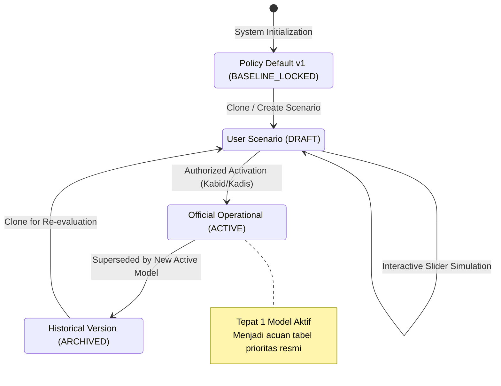

# APPLICATION ARCHITECTURE SPECIFICATION v1
## Sistem Pendukung Prioritas Penanganan Jalan Kabupaten Hulu Sungai Selatan

**Dokumen Spesifikasi Arsitektur Sistem & Rekayasa Perangkat Lunak**  
**Versi:** 1.0.0 (MVP Release)  
**Status:** Frozen for Implementation  
**Orkestrator Arsitektur:** Antigravity  
**Tanggal:** 12 September 2026  
**Governing Documents:**
- [`reports/PRD_MVP_V1.md`](file:///f:/WebApps/6.diklat_pim/diklat_pim_working_bundle_v1/reports/PRD_MVP_V1.md)
- [`reports/DATA_MODEL_V1.md`](file:///f:/WebApps/6.diklat_pim/diklat_pim_working_bundle_v1/reports/DATA_MODEL_V1.md)
- [`reports/SCORING_ENGINE_CONTRACT_V1.md`](file:///f:/WebApps/6.diklat_pim/diklat_pim_working_bundle_v1/reports/SCORING_ENGINE_CONTRACT_V1.md)

---

## 1. ARCHITECTURAL PRINCIPLES & BOUNDARIES

Sistem dirancang sebagai **aplikasi web modern satu kesatuan (*cohesive modern web application*)** yang mengutamakan performa responsif, transparansi perhitungan, dan ketegasan batas otoritas:

```
+---------------------------------------------------------------------------------------------------------+
|                                    APPLICATION ARCHITECTURE OVERVIEW                                    |
+---------------------------------------------------------------------------------------------------------+
|                                                                                                         |
|   [ CLIENT TIER: REACT / NEXT.JS FRONTEND ]                                                             |
|   +-----------------------+ +-----------------------+ +-----------------------+ +--------------------+  |
|   | Dashboard & Analytics | | Ranking & Filter UI   | | Interactive Web GIS   | | Road Detail Card   |  |
|   +-----------------------+ +-----------------------+ +-----------------------+ +--------------------+  |
|   +-----------------------+ +-----------------------+ +-----------------------+ +--------------------+  |
|   | Model Config Sliders  | | Scenario Comparison   | | Version & Activation  | | Provenance Audit   |  |
|   +-----------------------+ +-----------------------+ +-----------------------+ +--------------------+  |
|                              |                                                                          |
|                              v Reactive State & Local Fast Re-scoring (< 10ms)                          |
|   +--------------------------------------------------------------------------------------------------+  |
|   | IN-BROWSER DETERMINISTIC SCORING ENGINE (TypeScript WebAssembly/Pure Math)                       |  |
|   | Eksekusi rebalancing slider hierarkis & simulasi instan 350 ruas tanpa round-trip server.          |  |
|   +--------------------------------------------------------------------------------------------------+  |
|                                         |                                                               |
|                                         v HTTP / JSON API                                               |
|   [ SERVER TIER: NEXT.JS API / FASTAPI BACKEND SERVICES ]                                               |
|   +--------------------+ +--------------------+ +--------------------+ +--------------------+           |
|   | Identity & Road    | | Condition & Data   | | Model Versioning & | | Authoritative GIS  |           |
|   | Service            | | Observation Svc    | | Activation Service | | GeoJSON Service    |           |
|   +--------------------+ +--------------------+ +--------------------+ +--------------------+           |
|                                         |                                                               |
|                                         v SQL / Spatial Queries                                         |
|   [ PERSISTENCE TIER: RELATIONAL / SPATIAL DATABASE ]                                                   |
|   - SQLite / PostgreSQL with PostGIS / DuckDB Embedded                                                  |
|   - Read-Only Authoritative Seed Storage (350 Roads, 1,400 Crosswalks, 2025 Condition Authority)        |
|                                                                                                         |
+---------------------------------------------------------------------------------------------------------+
```

### Prinsip Desain:
1. **Zero-Latency Reactive Simulation:** Untuk memberikan pengalaman interaktif bagi pengambil keputusan saat menggeser slider bobot, kalkulasi agregasi skoring 350 ruas dieksekusi secara instan di sisi klien (*in-browser micro-engine*) dalam waktu $< 10\text{ milidetik}$.
2. **Server-Side Authoritative Verification:** Setiap aksi penyimpanan draf model atau pengesahan model aktif wajib divalidasi dan dihitung ulang di sisi server untuk menjamin integritas kriptografis dan auditibilitas matematis.
3. **Strict Authority Isolation:** Geometri konektor jembatan sintetis (`network_connectors.geojson`), atribut kondisi lama 2023, dan acuan historis `label_top105` diisolasi sepenuhnya dari jalur skoring operasional.

---

## 2. APPLICATION MODULES & SERVICE BOUNDARIES

Sistem dipecah menjadi 5 modul layanan mandiri (*modular domain services*):

### Modul 1: `RoadIdentityService` (Layanan Identitas Kanonikal)
* **Tanggung Jawab:**
  - Menyajikan katalog 350 ruas jalan kanonikal.
  - Memastikan pencarian ruas hanya berbasis `road_key`, `nomor_ruas`, atau alias resmi.
  - Menolak pencocokan berbasis nama bebas (*enforce zero name-join policy*).
  - Menyediakan metadata kualifikasi geografis untuk ruas kembar (`display_name`).

### Modul 2: `RoadConditionService` (Layanan Kondisi Jalan & Observasi)
* **Tanggung Jawab:**
  - Mengelola repositori data kondisi tahunan (Otoritas Kondisi 2025 vs Baseline Survei 2024).
  - Menyajikan matriks 17 observasi mentah dan normalisasi per ruas jalan.
  - Mengisolasi data kondisi usang (2023) agar tidak merembes ke perhitungan aktif.

### Modul 3: `PriorityScoringService` (Mesin Skoring Deterministik)
* **Tanggung Jawab:**
  - Menerapkan kontrak matematis skoring 17 variabel ([`SCORING_ENGINE_CONTRACT_V1.md`](file:///f:/WebApps/6.diklat_pim/diklat_pim_working_bundle_v1/reports/SCORING_ENGINE_CONTRACT_V1.md)).
  - Mengeksekusi normalisasi dinamis bobot kategori: $W_k^* = W_k / \sum W_j$.
  - Menghitung kontribusi faktor, subtotal kategori, skor komposit, dan peringkat kontigu $\{1..350\}$.
  - Menerapkan *cascading deterministic tie-breaker* jika terjadi skor kembar.

### Modul 4: `ModelGovernanceService` (Layanan Versi Model & Simulasi)
* **Tanggung Jawab:**
  - Mengelola siklus hidup model (`BASELINE_LOCKED`, `DRAFT`, `ACTIVE`, `ARCHIVED`).
  - Memastikan model `Policy Default v1` tidak dapat diubah atau dihapus (*immutable anchor*).
  - Mengelola penyimpanan draf simulasi pengguna dan pencatatan riwayat aktivasi model oleh Kabid/Kadis.

### Modul 5: `SpatialMapService` (Layanan Visualisasi Spasial Web GIS)
* **Tanggung Jawab:**
  - Menyajikan GeoJSON 350 linestring ruas jalan kabupaten (`roads_county.geojson`) yang terikat ke `road_key`.
  - Menyajikan layer tematik fasilitas umum (RSUD, Puskesmas, Sekolah, Pasar) dan batas administrasi.
  - Memfilter dan mengeksklusi `network_connectors.geojson` dari layer kandidat penanganan.

---

## 3. MODEL LIFECYCLE & GOVERNANCE STATE MACHINE

Arsitektur tata kelola versi model diatur melalui diagram status berikut:



### Aturan Transisi Status:
1. **`BASELINE_LOCKED`:** Tercipta otomatis saat inisialisasi sistem dari seed v5. Read-only abadi.
2. **`DRAFT`:** Dapat dibuat oleh Decision-Maker atau Administrator dengan menyalin model yang ada. Perubahan bobot pada status draf bersifat lokal dan tidak berdampak pada pengguna lain.
3. **`ACTIVE`:** Hanya Decision-Maker (Kabid/Kadis) yang memiliki wewenang menggeser status DRAFT menjadi ACTIVE. Saat model baru diaktifkan:
   - Model aktif sebelumnya otomatis beralih status menjadi `ARCHIVED`.
   - Sistem merekam log aktivasi: `activated_by`, `activated_at`, dan `activation_note`.
4. **`ARCHIVED`:** Model historis yang disimpan permanen untuk keperluan pelacakan audit dan pertanggungjawaban perencanaan tahunan.

---

## 4. FRONTEND ARCHITECTURE & REACTIVE STATE FLOW

### 4.1 State Management (Zustand Store)
Frontend menggunakan arsitektur *lightweight central reactive store* (Zustand) yang memisahkan antara data acuan statis dengan state simulasi:

```typescript
interface PriorityAppState {
  // Master Reference Data (Immutable)
  roads: Record<string, RoadEntity>;               // 350 roads keyed by road_key
  geometries: GeoJSON.FeatureCollection;           // 350 Linestrings
  facilities: GeoJSON.FeatureCollection;           // 285 Public Facilities
  observations: Record<string, RoadObservation17>; // Keyed by road_key
  
  // Operating Mode Selection
  operatingMode: 'OPERATIONAL_2025' | 'BENCHMARK_2024';
  
  // Model Governance State
  activeModel: PriorityModelConfig;
  draftModel: PriorityModelConfig;
  isSimulating: boolean;
  
  // Real-Time Computed State
  activeScores: Record<string, RoadScoreResult>;   // Pre-computed active ranking
  simulatedScores: Record<string, RoadScoreResult>;// Instant reactive simulated ranking
  
  // Actions
  setOperatingMode: (mode: 'OPERATIONAL_2025' | 'BENCHMARK_2024') => void;
  updateCategoryWeight: (categoryCode: string, newRawWeight: number) => void;
  updateVariableWeight: (categoryCode: string, variableCode: string, newLocalWeight: number) => void;
  resetDraftToActive: () => void;
  resetDraftToBaseline: () => void;
  saveDraftModel: (name: string, description: string) => Promise<void>;
  activateModel: (modelId: string, note: string) => Promise<void>;
}
```

### 4.2 Alur Komputasi Reaktif Slider (< 10ms Latency)
Saat pengguna menggeser slider bobot:
1. **Slider Event:** Mengirim nilai baru $W'_m$ atau $w'_{m,a}$.
2. **Auto-Balancing Invariant Guard:** Fungsi murni (*pure function*) mengeksekusi rebalancing sibling tanpa efek samping (*no cross-branch leakage*).
3. **Array Matrix Multiplication:** Vektor 17 bobot efektif $\mathbf{\Omega}$ dikalikan terhadap matriks observasi $\mathbf{X} \in \mathbb{R}^{350 \times 17}$ via operasi linier TypedArray.
4. **Sorting & Delta Calculation:** 350 ruas diurutkan descending, pergeseran peringkat ($\Delta\text{Rank}$) dihitung terhadap `activeScores`.
5. **UI Re-render:** Komponen tabel dan pewarnaan linestring peta diperbarui secara serempak.

---

## 5. RECOMMENDED PRAGMATIC TECHNOLOGY STACK

Untuk memastikan keandalan operasional di lingkungan instansi daerah tanpa beban *over-engineering*:

| Layer | Teknologi yang Dipilih | Justifikasi Teknis |
|---|---|---|
| **Framework Utama** | **Next.js 14 (App Router) + TypeScript** | Satu basis kode terpadu untuk UI, API routes, dan Server-Side Rendering (SSR) yang handal |
| **Styling & Komponen** | **Tailwind CSS + Lucide Icons + Shadcn UI** | Komponen antarmuka yang bersih, profesional, aksesibel, dan cepat dibangun |
| **Web GIS Engine** | **Leaflet / React-Leaflet** | Sangat ringan, stabil, mendukung render 350 linestring WGS84 secara mulus di seluruh browser klien |
| **State Management** | **Zustand** | Manajemen state mikro-reaktif dengan latensi nol untuk kalkulasi slider tanpa *unnecessary re-renders* |
| **Persistence / Database** | **SQLite (via Prisma/Drizzle) atau PostgreSQL** | Sederhana, tanpa dependensi server eksternal yang rumit untuk fase MVP; siap dimigrasi ke Postgres/PostGIS |
| **Validasi Skema** | **Zod** | Menjamin integritas payload API, validasi aturan batas bobot, dan penolakan data tak dikenal |

---
*Dokumen Spesifikasi Arsitektur Aplikasi v1 ini dibekukan sebagai standar rekayasa perangkat lunak Sistem Pendukung Prioritas Penanganan Jalan Kabupaten Hulu Sungai Selatan.*
