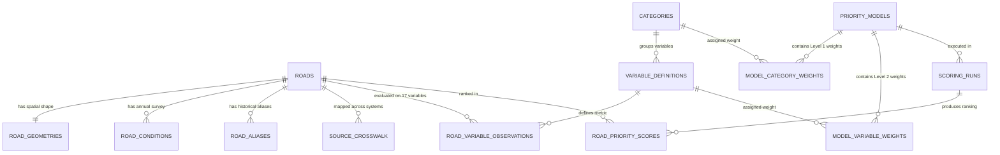

# DATA MODEL SPECIFICATION v1
## Sistem Pendukung Prioritas Penanganan Jalan Kabupaten Hulu Sungai Selatan

**Dokumen Spesifikasi Model Data & Arsitektur Basis Data Relasional**  
**Versi:** 1.0.0 (MVP Release)  
**Status:** Frozen for Implementation  
**Orkestrator Arsitektur:** Antigravity  
**Tanggal:** 12 September 2026  
**Governing Documents:**
- [`00_START_HERE/AUTHORITY_SUMMARY.json`](file:///f:/WebApps/6.diklat_pim/diklat_pim_working_bundle_v1/00_START_HERE/AUTHORITY_SUMMARY.json)
- [`reports/PRD_MVP_V1.md`](file:///f:/WebApps/6.diklat_pim/diklat_pim_working_bundle_v1/reports/PRD_MVP_V1.md)
- [`reports/PRIORITY_MODEL_SPECIFICATION_V1.md`](file:///f:/WebApps/6.diklat_pim/diklat_pim_working_bundle_v1/reports/PRIORITY_MODEL_SPECIFICATION_V1.md)

---

## 1. DATA ARCHITECTURE PHILOSOPHY

Arsitektur data MVP dirancang dengan prinsip **separasi domain yang ketat (*strict domain separation*)** untuk mencegah kontaminasi antara fakta fisik lapangan dengan konfigurasi model kebijakan:

```
+---------------------------------------------------------------------------------------------------+
|                                      DATA ARCHITECTURE LAYERS                                     |
+---------------------------------------------------------------------------------------------------+
|                                                                                                   |
|  [ LAYER 1: SOURCE FACTS ]                                                                        |
|  Fakta mentah yang diverifikasi secara otoritatif dari dokumen dinas & survei fisik lapangan.     |
|  - roads (350 ruas kanonikal)          - road_geometries (LineString 4326)                        |
|  - road_conditions (kondisi tahunan)   - public_facilities (285 titik fasum)                      |
|  - administrative_districts / villages - source_crosswalk & road_aliases                          |
|  Karakter: IMMUTABLE / APPEND-ONLY PER SURVEY YEAR (Dimutakhirkan hanya lewat rilis resmi).        |
|                                                                                                   |
+-------------------------------------------------+-------------------------------------------------+
                                                  |
                                                  v
+---------------------------------------------------------------------------------------------------+
|  [ LAYER 2: DERIVED OBSERVATIONS ]                                                                |
|  Nilai mentah dan ternormalisasi dari 17 variabel per ruas jalan yang diekstraksi dari Layer 1.   |
|  - variable_definitions (Kamus 17 variabel normatif)                                              |
|  - road_variable_observations (Mode Operasional 2025 vs Mode Acuan Baseline 2024)                 |
|  Karakter: DETERMINISTIC & RECOMPUTABLE (Dapat direkonstruksi 100% dari Layer 1).                 |
+-------------------------------------------------+-------------------------------------------------+
                                                  |
                                                  v
+---------------------------------------------------------------------------------------------------+
|  [ LAYER 3: MODEL CONFIGURATION ]                                                                 |
|  Konfigurasi kebijakan pembobotan hirarkis Level 1 & Level 2 yang dapat disimulasikan.            |
|  - priority_models (Baseline v1, Model Aktif, Draf Simulasi, Model Arsip)                         |
|  - model_category_weights (Level 1: 4 Kategori Induk, auto-balancing)                              |
|  - model_variable_weights (Level 2: 17 Variabel Lokal, auto-balancing)                            |
|  Karakter: VERSIONED & MUTABLE IN DRAFT (Baseline terkunci permanen, draf terisolasi).             |
+-------------------------------------------------+-------------------------------------------------+
                                                  |
                                                  v
+---------------------------------------------------------------------------------------------------+
|  [ LAYER 4: COMPUTED SCORING RESULTS ]                                                            |
|  Hasil perkalian skoring linier deterministik dan perankingan prioritas 1 s.d. 350.               |
|  - scoring_runs (Sesi eksekusi skoring berdasar kombinasi Model + Dataset Mode)                   |
|  - road_priority_scores (Dekomposisi transparan kontribusi 17 faktor & peringkat)                 |
|  Karakter: EPHEMERAL IN SIMULATION / PERSISTED ON MODEL ACTIVATION.                                |
+---------------------------------------------------------------------------------------------------+
```

---

## 2. ENTITY RELATIONSHIP DIAGRAM (MERMAID)



---

## 3. RELATIONAL SCHEMA SPECIFICATION (DDL & DATA DICTIONARY)

### 3.1 Layer 1: Source Facts (Data Dasar Otoritatif)

#### 1. Tabel: `roads` (Master Ruas Jalan Kanonikal)
* **Deskripsi:** Entitas inti sistem yang menyimpan 350 ruas jalan kabupaten Hulu Sungai Selatan yang sah.
* **Source of Truth:** `01_authoritative_seed/.../authoritative/road_registry_authoritative.csv`.
* **Mutabilitas:** Read-Only / Hanya diperbarui jika ada SK Bupati perubahan status jaringan jalan baru.

```sql
CREATE TABLE roads (
    road_id             UUID PRIMARY KEY,                 -- UUIDv5 deterministik
    road_key            VARCHAR(16) NOT NULL UNIQUE,      -- Kunci kanonikal: HSS-KAB-001 s.d. HSS-KAB-350
    nomor_ruas          VARCHAR(8) NOT NULL UNIQUE,       -- Nomor ruas resmi SK: 001 s.d. 350
    canonical_name      VARCHAR(255) NOT NULL,            -- Nama sumber resmi Dashboard 2025
    display_name        VARCHAR(255) NOT NULL UNIQUE,     -- Nama tampilan UI (termasuk kualifikasi duplikat)
    district_name       VARCHAR(100) NOT NULL,            -- Nama kecamatan utama (2025)
    village_coverage    TEXT NOT NULL,                    -- Deskripsi desa terlintasi dari survei
    length_km_official  DECIMAL(8, 3) NOT NULL,           -- Panjang resmi SK (km)
    width_m_official    DECIMAL(5, 2) NOT NULL,           -- Lebar perkerasan rata-rata (m)
    identity_status     VARCHAR(32) NOT NULL DEFAULT 'AUTHORITATIVE_V1',
    created_at          TIMESTAMP WITH TIME ZONE NOT NULL DEFAULT CURRENT_TIMESTAMP,
    updated_at          TIMESTAMP WITH TIME ZONE NOT NULL DEFAULT CURRENT_TIMESTAMP
);

CREATE INDEX idx_roads_road_key ON roads(road_key);
CREATE INDEX idx_roads_nomor_ruas ON roads(nomor_ruas);
CREATE INDEX idx_roads_district ON roads(district_name);
```

#### 2. Tabel: `road_geometries` (Geometri Spasial Ruas)
* **Deskripsi:** Menyimpan representasi spasial linestring koordinat bumi (WGS84 EPSG:4326) untuk rendering peta web.
* **Source of Truth:** `01_authoritative_seed/.../spatial/roads_county.geojson`.

```sql
CREATE TABLE road_geometries (
    road_id             UUID PRIMARY KEY REFERENCES roads(road_id) ON DELETE RESTRICT,
    road_key            VARCHAR(16) NOT NULL UNIQUE REFERENCES roads(road_key) ON DELETE RESTRICT,
    geometry_geojson    JSONB NOT NULL,                   -- GeoJSON MultiLineString coordinates
    geometry_length_m   DECIMAL(12, 2) NOT NULL,          -- Panjang kalkulasi spasial (meter)
    centroid_lat        DECIMAL(10, 7) NOT NULL,          -- Latitude titik tengah
    centroid_lng        DECIMAL(10, 7) NOT NULL,          -- Longitude titik tengah
    bbox_min_lat        DECIMAL(10, 7) NOT NULL,
    bbox_min_lng        DECIMAL(10, 7) NOT NULL,
    bbox_max_lat        DECIMAL(10, 7) NOT NULL,
    bbox_max_lng        DECIMAL(10, 7) NOT NULL,
    crs_declared        VARCHAR(32) NOT NULL DEFAULT 'EPSG:4326'
);
```

#### 3. Tabel: `road_conditions` (Kondisi Jalan Tahunan)
* **Deskripsi:** Riwayat kondisi kerusakan jalan tahunan dari survei lapangan resmi Dinas PUTR.
* **Source of Truth:** `01_authoritative_seed/.../conditions/road_conditions_2025.csv`.

```sql
CREATE TABLE road_conditions (
    condition_id        UUID PRIMARY KEY,
    road_key            VARCHAR(16) NOT NULL REFERENCES roads(road_key) ON DELETE RESTRICT,
    survey_year         INTEGER NOT NULL,                 -- Contoh: 2025 (Operational), 2024 (Baseline)
    baik_km             DECIMAL(8, 3) NOT NULL DEFAULT 0,
    baik_pct            DECIMAL(6, 3) NOT NULL DEFAULT 0,
    sedang_km           DECIMAL(8, 3) NOT NULL DEFAULT 0,
    sedang_pct          DECIMAL(6, 3) NOT NULL DEFAULT 0,
    rusak_ringan_km     DECIMAL(8, 3) NOT NULL DEFAULT 0,
    rusak_ringan_pct    DECIMAL(6, 3) NOT NULL DEFAULT 0,
    rusak_berat_km      DECIMAL(8, 3) NOT NULL DEFAULT 0,
    rusak_berat_pct     DECIMAL(6, 3) NOT NULL DEFAULT 0,
    mantap_km           DECIMAL(8, 3) NOT NULL,
    mantap_pct          DECIMAL(6, 3) NOT NULL,
    tidak_mantap_km     DECIMAL(8, 3) NOT NULL,
    tidak_mantap_pct    DECIMAL(6, 3) NOT NULL,
    total_panjang_km    DECIMAL(8, 3) NOT NULL,
    authority_status    VARCHAR(32) NOT NULL,             -- 'FINAL_2025' atau 'HISTORIC_2024'
    source_filename     VARCHAR(255) NOT NULL,
    created_at          TIMESTAMP WITH TIME ZONE NOT NULL DEFAULT CURRENT_TIMESTAMP,
    CONSTRAINT uq_road_condition_year UNIQUE (road_key, survey_year)
);

CREATE INDEX idx_conditions_lookup ON road_conditions(road_key, survey_year);
```

#### 4. Tabel: `public_facilities` (Titik Fasilitas Pelayanan Umum)
* **Deskripsi:** Sebaran titik fasilitas publik di Hulu Sungai Selatan untuk overlay peta dan verifikasi jarak aksesibilitas.
* **Source of Truth:** `facilities/public_facilities.geojson` (285 titik).

```sql
CREATE TABLE public_facilities (
    facility_id         UUID PRIMARY KEY,
    facility_type       VARCHAR(32) NOT NULL,             -- 'RSUD', 'PUSKESMAS', 'SCHOOL', 'MARKET'
    facility_name       VARCHAR(255) NOT NULL,
    district_name       VARCHAR(100),
    village_name        VARCHAR(100),
    latitude            DECIMAL(10, 7) NOT NULL,
    longitude           DECIMAL(10, 7) NOT NULL,
    source_layer        VARCHAR(100) NOT NULL
);

CREATE INDEX idx_facilities_type ON public_facilities(facility_type);
```

#### 5. Tabel: `source_crosswalk` (Kamus Silang Sistem Sumber)
* **Deskripsi:** Menjembatani seluruh ID lama lintas 4 sistem tanpa fuzzy matching.
* **Source of Truth:** `01_authoritative_seed/.../authoritative/source_crosswalk.csv` (1.400 baris).

```sql
CREATE TABLE source_crosswalk (
    crosswalk_id        UUID PRIMARY KEY,
    source_system       VARCHAR(64) NOT NULL,             -- 'dashboard_2025', 'qgis_county_roads', dll
    source_id           VARCHAR(64) NOT NULL,             -- ID pada sistem sumber
    source_name         VARCHAR(255) NOT NULL,
    road_key            VARCHAR(16) NOT NULL REFERENCES roads(road_key) ON DELETE RESTRICT,
    canonical_display   VARCHAR(255) NOT NULL,
    match_method        VARCHAR(64) NOT NULL,             -- 'OFFICIAL_NO_RUAS', dll
    match_status        VARCHAR(32) NOT NULL DEFAULT 'VERIFIED',
    CONSTRAINT uq_system_source_id UNIQUE (source_system, source_id)
);

CREATE INDEX idx_crosswalk_lookup ON source_crosswalk(source_system, source_id);
CREATE INDEX idx_crosswalk_road_key ON source_crosswalk(road_key);
```

---

### 3.2 Layer 2: Derived Observations (Observasi 17 Variabel)

#### 6. Tabel: `categories` (Kamus 4 Kategori Induk)
* **Deskripsi:** Menyimpan definisi baku 4 kategori agregasi.

```sql
CREATE TABLE categories (
    category_code       VARCHAR(32) PRIMARY KEY,          -- 'TEKNIS_JALAN', 'AKSESIBILITAS', dll
    category_name       VARCHAR(100) NOT NULL,
    description         TEXT NOT NULL,
    display_order       INTEGER NOT NULL,
    default_weight_raw  DECIMAL(8, 6) NOT NULL            -- 0.378965, 0.283815, 0.192412, 0.144807
);
```

#### 7. Tabel: `variable_definitions` (Kamus 17 Variabel Normatif)
* **Deskripsi:** Spesifikasi baku seluruh 17 variabel prioritas.

```sql
CREATE TABLE variable_definitions (
    variable_code       VARCHAR(64) PRIMARY KEY,          -- 'norm_panjang_ruas', dll
    category_code       VARCHAR(32) NOT NULL REFERENCES categories(category_code),
    variable_label      VARCHAR(100) NOT NULL,
    definition          TEXT NOT NULL,
    optimization_dir    VARCHAR(16) NOT NULL,             -- 'BENEFIT' atau 'COST'
    raw_unit            VARCHAR(32) NOT NULL,             -- 'km', 'm', 'jiwa', 'rasio', 'biner'
    raw_source_field    VARCHAR(100) NOT NULL,
    normalization_rule  VARCHAR(64) NOT NULL,             -- 'LINEAR_MINMAX', 'CLAMPED_MINMAX', dll
    param_min           DECIMAL(12, 4),                   -- Batas bawah normalisasi (misal 0.06 km)
    param_max           DECIMAL(12, 4),                   -- Batas atas normalisasi (misal 17.11 km)
    is_recomputable     BOOLEAN NOT NULL DEFAULT TRUE,
    display_order       INTEGER NOT NULL
);
```

#### 8. Tabel: `road_variable_observations` (Nilai Mentah & Normalisasi Ruas)
* **Deskripsi:** Matriks observasi 17 variabel per ruas jalan. Membedakan secara tegas antara nilai Operasional 2025 dengan nilai Benchmark 2024.

```sql
CREATE TABLE road_variable_observations (
    observation_id      UUID PRIMARY KEY,
    road_key            VARCHAR(16) NOT NULL REFERENCES roads(road_key) ON DELETE RESTRICT,
    operating_mode      VARCHAR(32) NOT NULL,             -- 'OPERATIONAL_2025' atau 'BENCHMARK_2024'
    variable_code       VARCHAR(64) NOT NULL REFERENCES variable_definitions(variable_code),
    raw_value           DECIMAL(16, 6) NOT NULL,          -- Nilai mentah (misal: panjang 3.42 km, jarak 450 m)
    normalized_value    DECIMAL(8, 6) NOT NULL,           -- Skor normalisasi [0.000000 s.d. 1.000000]
    calculated_at       TIMESTAMP WITH TIME ZONE NOT NULL DEFAULT CURRENT_TIMESTAMP,
    CONSTRAINT uq_road_obs UNIQUE (road_key, operating_mode, variable_code),
    CONSTRAINT chk_norm_range CHECK (normalized_value >= 0.0 AND normalized_value <= 1.0)
);

CREATE INDEX idx_obs_lookup ON road_variable_observations(road_key, operating_mode);
```

---

### 3.3 Layer 3: Model Configuration (Tata Kelola Bobot & Versi)

#### 9. Tabel: `priority_models` (Entitas Versi Model)
* **Deskripsi:** Menyimpan metadata versi model prioritas (Baseline, Draf, Aktif, Arsip).

```sql
CREATE TABLE priority_models (
    model_id            UUID PRIMARY KEY,
    model_code          VARCHAR(64) NOT NULL UNIQUE,      -- 'POLICY_DEFAULT_V1', 'DRAFT_USER_12', dll
    model_name          VARCHAR(255) NOT NULL,
    description         TEXT,
    model_lifecycle     VARCHAR(32) NOT NULL,             -- 'BASELINE_LOCKED', 'DRAFT', 'ACTIVE', 'ARCHIVED'
    operating_mode      VARCHAR(32) NOT NULL DEFAULT 'OPERATIONAL_2025',
    is_locked           BOOLEAN NOT NULL DEFAULT FALSE,   -- True jika BASELINE_LOCKED atau ACTIVE
    created_by_user_id  VARCHAR(64) NOT NULL,
    created_at          TIMESTAMP WITH TIME ZONE NOT NULL DEFAULT CURRENT_TIMESTAMP,
    updated_at          TIMESTAMP WITH TIME ZONE NOT NULL DEFAULT CURRENT_TIMESTAMP,
    activated_by_user_id VARCHAR(64),                     -- Diisi hanya jika ACTIVE
    activated_at        TIMESTAMP WITH TIME ZONE,
    activation_note     TEXT                              -- Justifikasi penetapan kebijakan oleh Kabid/Kadis
);

CREATE INDEX idx_models_lifecycle ON priority_models(model_lifecycle);
```

#### 10. Tabel: `model_category_weights` (Bobot Level 1 Kategori)
* **Deskripsi:** Menyimpan 4 bobot kategori Level 1 untuk tiap model.

```sql
CREATE TABLE model_category_weights (
    weight_id           UUID PRIMARY KEY,
    model_id            UUID NOT NULL REFERENCES priority_models(model_id) ON DELETE CASCADE,
    category_code       VARCHAR(32) NOT NULL REFERENCES categories(category_code),
    raw_weight          DECIMAL(8, 6) NOT NULL,           -- Nilai mentah slider (misal: 0.378965)
    normalized_weight   DECIMAL(10, 8) NOT NULL,          -- raw_weight / sum(raw_weights)
    is_locked           BOOLEAN NOT NULL DEFAULT FALSE,   -- Toggle lock slider di UI
    CONSTRAINT uq_model_category UNIQUE (model_id, category_code)
);
```

#### 11. Tabel: `model_variable_weights` (Bobot Level 2 Lokal Variabel)
* **Deskripsi:** Menyimpan 17 bobot lokal variabel Level 2 dan bobot efektif global terhitung.

```sql
CREATE TABLE model_variable_weights (
    weight_id           UUID PRIMARY KEY,
    model_id            UUID NOT NULL REFERENCES priority_models(model_id) ON DELETE CASCADE,
    variable_code       VARCHAR(64) NOT NULL REFERENCES variable_definitions(variable_code),
    category_code       VARCHAR(32) NOT NULL REFERENCES categories(category_code),
    local_weight        DECIMAL(8, 6) NOT NULL,           -- Bobot lokal dalam kategori (Sum = 1.0)
    effective_weight    DECIMAL(10, 8) NOT NULL,          -- normalized_category_weight * local_weight
    is_locked           BOOLEAN NOT NULL DEFAULT FALSE,   -- Toggle lock slider di UI
    CONSTRAINT uq_model_variable UNIQUE (model_id, variable_code)
);
```

---

### 3.4 Layer 4: Computed Results & Audit

#### 12. Tabel: `scoring_runs` (Riwayat Sesi Skoring)
* **Deskripsi:** Mencatat riwayat eksekusi kalkulasi skor prioritas untuk auditibilitas.

```sql
CREATE TABLE scoring_runs (
    run_id              UUID PRIMARY KEY,
    model_id            UUID NOT NULL REFERENCES priority_models(model_id),
    operating_mode      VARCHAR(32) NOT NULL,             -- 'OPERATIONAL_2025' atau 'BENCHMARK_2024'
    roads_evaluated     INTEGER NOT NULL DEFAULT 350,
    top105_concordance  DECIMAL(5, 2),                    -- Persentase overlap terhadap Top-105 (misal 81.71%)
    execution_time_ms   INTEGER NOT NULL,                 -- Waktu komputasi (target < 50ms)
    run_by_user_id      VARCHAR(64) NOT NULL,
    executed_at         TIMESTAMP WITH TIME ZONE NOT NULL DEFAULT CURRENT_TIMESTAMP
);
```

#### 13. Tabel: `road_priority_scores` (Hasil Peringkat & Dekomposisi 17 Faktor)
* **Deskripsi:** Menyimpan rincian dekomposisi kalkulasi skor akhir untuk 350 ruas jalan pada setiap run resmi.

```sql
CREATE TABLE road_priority_scores (
    score_id            UUID PRIMARY KEY,
    run_id              UUID NOT NULL REFERENCES scoring_runs(run_id) ON DELETE CASCADE,
    road_key            VARCHAR(16) NOT NULL REFERENCES roads(road_key),
    final_score         DECIMAL(10, 8) NOT NULL,          -- Skor komposit [0.0 s.d. 1.0]
    priority_rank       INTEGER NOT NULL,                 -- Peringkat 1 s.d. 350
    tier_category       VARCHAR(16) NOT NULL,             -- 'TOP_35', 'TOP_70', 'TOP_105', 'REGULAR'
    subtotal_teknis     DECIMAL(10, 8) NOT NULL,          -- Kontribusi Kategori 1
    subtotal_akses      DECIMAL(10, 8) NOT NULL,          -- Kontribusi Kategori 2
    subtotal_pelayanan  DECIMAL(10, 8) NOT NULL,          -- Kontribusi Kategori 3
    subtotal_spasial    DECIMAL(10, 8) NOT NULL,          -- Kontribusi Kategori 4
    factor_breakdown    JSONB NOT NULL,                   -- Rincian 17 faktor {variable: {raw, norm, eff, contrib}}
    CONSTRAINT uq_run_road UNIQUE (run_id, road_key),
    CONSTRAINT uq_run_rank UNIQUE (run_id, priority_rank) -- Garansi tidak ada peringkat kembar
);

CREATE INDEX idx_scores_rank ON road_priority_scores(run_id, priority_rank);
CREATE INDEX idx_scores_road ON road_priority_scores(run_id, road_key);
```

---

## 4. DATA INTEGRITY INVARIANTS & ENFORCEMENT RULES

1. **Invarian Kunci Identitas:** Seluruh relasi *foreign key* wajib mengarah ke `road_key` atau `road_id`. Nama ruas jalan `canonical_name` dan `display_name` dilarang keras menjadi target relasi foreign key.
2. **Invarian Bobot Kategori Level 1:**
   $$\sum_{k=1}^4 \text{normalized\_weight}_k = 1.00000000 \quad (\pm 10^{-12})$$
3. **Invarian Bobot Lokal Level 2:**
   $$\sum_{i=1}^{n_k} \text{local\_weight}_{k, i} = 1.00000000 \quad (\forall k \in \{1..4\})$$
4. **Invarian Bobot Efektif Terhitung:**
   $$\sum_{k=1}^4 \sum_{i=1}^{n_k} \text{effective\_weight}_{k, i} = 1.00000000$$
5. **Invarian Peringkat Unik (Strict Bijective Ranking):** Pada satu sesi `run_id`, nilai kolom `priority_rank` wajib membentuk barisan aritmatika kontigu $\{1, 2, 3, \dots, 350\}$. Duplikasi peringkat dilarang secara fisik melalui *unique constraint* `uq_run_rank`.

---
*Dokumen Spesifikasi Model Data v1 ini dibekukan sebagai standar skema penyimpanan basis data Sistem Pendukung Prioritas Penanganan Jalan Kabupaten Hulu Sungai Selatan.*
